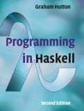

# haskell-solutions

Solutions to "Programming in Haskell", 2nd ed., by Graham Hutton.

More information about the book, including video lectures, slides and
[errata](http://www.cs.nott.ac.uk/~pszgmh/pih-errata.html) is available on the
book's [official website](https://www.cs.nott.ac.uk/~pszgmh/pih.html).

## Testing

Programs were tested using GHC version 8.6.3 or greater. Exercises that are
simply "test XYZ in GHCi" will not be reproduced unless there is something
notable.
